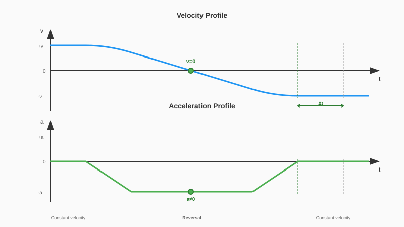
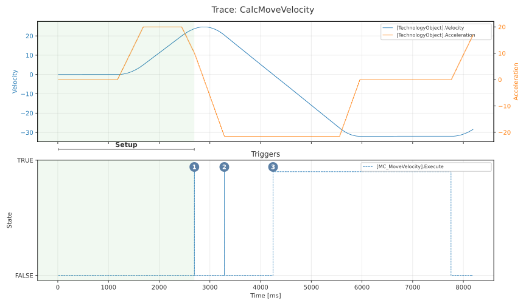

# @simatic-ax/dynamic-reversal

The library SIMATIC Dynamic Reversal (LDR) enables smooth velocity reversals for S7-1500 Technology Objects without requiring the axis to come to a complete stop.

Standard Motion Control instructions reach zero velocity **and** zero acceleration (v=0, a=0) before reversing direction. LDR offers an alternative: the axis crosses zero velocity while acceleration remains non-zero, reversing direction in one fluid motion.



## Getting started

Install with Apax:

> If not yet done login to the GitHub registry first.
> More information you'll find [here](https://github.com/simatic-ax/.github/blob/main/docs/personalaccesstoken.md)

```cli
apax add @simatic-ax/dynamic-reversal
```

Import the namespace in your ST code:

```iec-st
USING Simatic.Ax.LDR;
```

## Library functionality

All blocks are in the namespace `Simatic.Ax.LDR`.

| Function Block | MC Instruction | Description |
| -------------- | -------------- | ----------- |
| `CalcMoveVelocity` | MC_MoveVelocity | Dynamic reversal for velocity-controlled motion |
| `CalcMoveAbsolute` | MC_MoveAbsolute | Dynamic reversal for absolute positioning |
| `CalcMoveRelative` | MC_MoveRelative | Dynamic reversal for relative positioning |

Each LDR block acts as a wrapper around its corresponding MC instruction:

1. User inputs flow into the LDR block (target position/velocity, dynamics, axis reference)
2. LDR calculates the appropriate parameters based on the current axis state and reversal phase
3. LDR outputs are connected to the corresponding Motion Control instruction
4. MC feedback (Busy, Done, Error, CommandAborted) is fed back into the LDR block

The LDR blocks do not contain direct calls to Motion Control instructions. They only read Technology Object data and provide calculated output parameters. This makes the library independent of the specific Motion Control version installed in your project.

### Call sequence

The LDR block must be called right **before** the corresponding Motion Control instruction in each program cycle:

```iec-st
USING Siemens.Simatic.MotionControl.Native;
USING Simatic.Ax.LDR;

PROGRAM MyProgram
    VAR
        ldr : CalcMoveVelocity;
        mcMoveVel : MC_MoveVelocity;
        myAxis : DB_ANY;
    END_VAR

    // 1. Call LDR block with user parameters and MC feedback
    ldr(axis := myAxis,
        execute := startReversal,
        velocity := -32.0,
        acceleration := 21.5,
        deceleration := 21.5,
        jerk := 54.0,
        direction := 0,
        mcOutputBusy := mcMoveVel.Busy,
        mcOutputError := mcMoveVel.Error,
        mcOutputCommandAborted := mcMoveVel.CommandAborted);

    // 2. Call MC instruction with LDR outputs
    mcMoveVel(Axis := myAxisRef^,
              Execute := ldr.mcExecute,
              Velocity := ldr.mcVelocity,
              Acceleration := ldr.mcAcceleration,
              Deceleration := ldr.mcDeceleration,
              Jerk := ldr.mcJerk,
              Direction := ldr.mcDirection);
END_PROGRAM
```

The resulting axis behavior when using dynamic reversal is shown in the following trace. There is a setup phase where the axis is brought to an initial velocity. This acts as a starting point for the velocity reversal using LDR.



The lower pane in the trace displays the effective rising edges on the `MC_MoveVelocity` instance.

1. **Decelerate with jerk limitation**: decelerate the axis with active jerk limitation
2. **Disable jerk limitation**: disable jerk limitation for zero crossing
3. **Enable jerk limitation after zero crossing**: re-enable jerk limitation once the velocity crosses zero

The concrete call diagrams for each function block are documented in the respective block documentation.

### Dynamics parameter conventions

The following conventions apply to all LDR function blocks:

| Parameter Value | Meaning |
| -------------- | ------- |
| `> 0.0` | Use the specified value |
| `= 0.0` | **Not permitted** for acceleration and deceleration (triggers error). For jerk: disables jerk limitation (trapezoid profile). For velocity: see individual block documentation. |
| `< 0.0` (e.g., `-1.0`) | Use the Technology Object's default value |

If a specified value exceeds the Technology Object's maximum, it is clamped to the maximum and a warning is issued.

### Technology object compatibility

| Function Block | TO_SpeedAxis | TO_PositioningAxis | TO_SynchronousAxis |
| -------------- | --- | --- | --- |
| CalcMoveVelocity | Yes | Yes | Yes |
| CalcMoveAbsolute | No | Yes | Yes |
| CalcMoveRelative | No | Yes | Yes |

Modulo axes are supported for `CalcMoveRelative` and `CalcMoveAbsolute`.

### Key features

- **Familiar interface** — parameters match the corresponding MC instructions
- **Automatic fallback** — if dynamic reversal is not possible, a standard motion profile is used
- **Typed status codes** — `Status`, `Warnings`, and `Errors` types for IDE discoverability

## Requirements

- S7-1500 CPU with at least FW 4.1
- SIMATIC AX Logic Control Engineering

## Documentation

| Document | Description |
| -------- | ----------- |
| [Velocity Reversal Information](docs/Basic_Information.md) | How dynamic reversal works |
| [CalcMoveVelocity](docs/CalcMoveVelocity.md) | Interface, behavior, and feasibility |
| [CalcMoveAbsolute](docs/CalcMoveAbsolute.md) | Interface, position/direction handling |
| [CalcMoveRelative](docs/CalcMoveRelative.md) | Interface, distance handling, overshoot |
| [Status Codes](docs/Status_Codes.md) | Complete status, warning, and error reference |

## Contribution

Thanks for your interest in contributing. Anybody is free to report bugs, unclear documentation, and other problems regarding this repository in the Issues section or, even better, is free to propose any changes to this repository using a pull request.

## License and Legal information

Please read the [Legal information](LICENSE.md)
