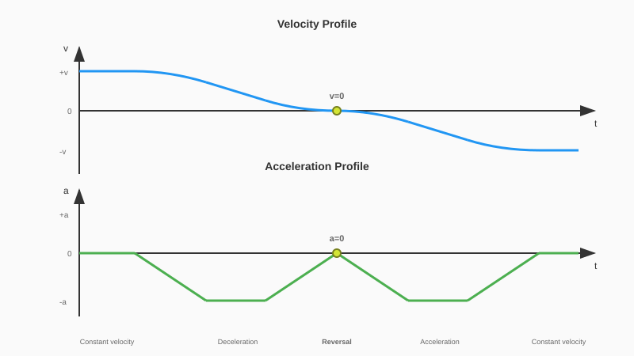

# Velocity Reversal Information

This chapter explains the fundamental concepts behind dynamic velocity reversal and how the LDR library achieves smoother, faster direction changes compared to standard Motion Control behavior.

## Standard Velocity Reversal

When using standard Motion Control instructions (MC_MoveAbsolute, MC_MoveRelative, MC_MoveVelocity) with jerk limitation enabled, a velocity reversal follows a specific pattern.

For an exemplary velocity reversal starting from a positive start velocity, the system reversal profile consists of four jerk-limited phases:

1. **Jerk ramp #1** (0 to -a_MC): Acceleration ramps from zero to maximum deceleration
2. **Constant deceleration**: Velocity decreases linearly at maximum deceleration rate
3. **Jerk ramp #2** (-a_MC to 0): Acceleration ramps back to zero as velocity approaches zero
4. **Jerk ramp #3** (0 to -a_MC): Acceleration ramps to maximum again for the new direction
5. **Constant acceleration**: Velocity increases linearly toward target
6. **Jerk ramp #4** (-a_MC to 0): Acceleration ramps to zero as target velocity is reached

At the reversal point, both velocity and acceleration are zero (v=0.0, a=0.0).

## Dynamic Velocity Reversal

The LDR library enables a different approach: the axis crosses zero velocity while maintaining non-zero acceleration. This eliminates the need to ramp acceleration down to zero and back up at the reversal point.

The dynamic reversal consists of only two jerk-limited phases:

1. **Jerk ramp #1** (0 to -a_MC): Acceleration ramps from zero to maximum
2. **Constant acceleration** (through v=0): Velocity decreases through zero and continues into the opposite direction
3. **Jerk ramp #2** (-a_MC to 0): Acceleration ramps to zero as target velocity is reached

At the reversal point, velocity is zero but acceleration remains at its maximum value (v=0.0, a=-a_MC). The axis does not stop but smoothly transitions through zero velocity in one continuous motion.

### Time Savings

By eliminating two jerk ramps at the reversal point, the LDR approach completes the same velocity change in less time. The time savings depend on the dynamics of the concrete motion control instruction.

## Implementation

The LDR library achieves dynamic reversal by temporarily disabling jerk limitation at the zero-velocity crossing point. The relevant SIMATIC Motion Control instructions offer the disabling of jerk limitation by setting the jerk at the instruction's interface to 0.0.

The library monitors the axis state and issues motion commands in three phases:

| Phase | Jerk Setting | Behavior |
| ----- | ------------ | -------- |
| **Phase 1** | Configured jerk | Decelerate toward zero velocity with S-curve profile |
| **Phase 2** | Jerk = 0.0 | Cross zero velocity with constant acceleration |
| **Phase 3** | Configured jerk | Accelerate to target velocity with S-curve profile |

The transition to Phase 2 occurs when the axis reaches the specified acceleration / deceleration for the Motion Control job. The transition to Phase 3 occurs immediately after the velocity crosses zero.

The library implements the dynamic reversal as a coordinated operation. Interrupting this mid-sequence has the potential to leave the application in an inconsistent state. For this reason, the LDR blocks do **not** support a re-triggering functionality on the same function block instance, while an initial job is still being processed.

The user can rely on the predictable abort mechanism of SIMATIC Motion Control instructions that detects and reports an abortion via the `CommandAborted` flag.

## When Dynamic Reversal is Not Possible

The library automatically falls back to standard motion profiles when dynamic reversal cannot be achieved:

| Condition | Reason | Library Behavior |
| --------- | ------ | ---------------- |
| **Insufficient distance** | Not enough travel to complete the dynamic profile | Warning `Warnings#NO_DYNAMIC_REVERSAL_POSSIBLE`, standard profile used |
| **Triangular profile** | Acceleration never reaches maximum value | Warning `Warnings#NO_DYNAMIC_REVERSAL_POSSIBLE`, standard profile used |
| **Jerk = 0** | Jerk limitation already disabled | Warning `Warnings#NO_DYNAMIC_REVERSAL_NEEDED_TRAPEZOID_CHOSEN`, standard profile used |
| **No reversal needed** | Velocity already in target direction | Warning `Warnings#NO_REVERSAL_NEEDED`, direct command issued |

In all cases the warnings indicate that the dynamic reversal optimization was not applied.
