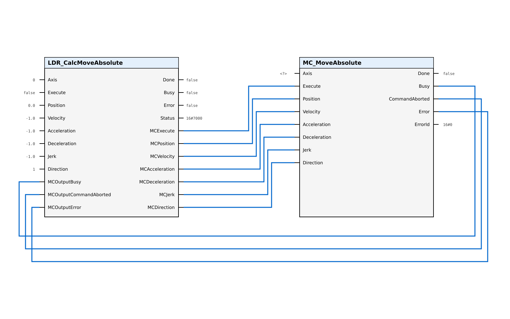

# CalcMoveAbsolute

The `CalcMoveAbsolute` function block enables dynamic velocity reversal for absolute positioning based on the `MC_MoveAbsolute` instruction. It calculates the parameters for `MC_MoveAbsolute` to achieve smooth direction changes without reaching a complete standstill.

## Applicable Technology Objects

| Technology Object | Supported |
| ----------------- | --------- |
| TO_SpeedAxis | No |
| TO_PositioningAxis | Yes |
| TO_SynchronousAxis | Yes |

## Call Diagram

The function block must be called **before** `MC_MoveAbsolute` in each program cycle.

## Interface

### VAR_INPUT

| Name | Type | Default | Description |
| ---- | ---- | ------- | ----------- |
| `axis` | DB_ANY | — | Technology Object axis reference |
| `execute` | BOOL | — | Rising edge starts the dynamic reversal calculation |
| `position` | LREAL | — | Absolute target position [Unit of TO] |
| `velocity` | LREAL | -1.0 | Velocity magnitude [Unit of TO]. < 0.0: use TO default. 0.0: not permitted. |
| `acceleration` | LREAL | -1.0 | Acceleration [Unit of TO]. < 0.0: use TO default. 0.0: not permitted. |
| `deceleration` | LREAL | -1.0 | Deceleration [Unit of TO]. < 0.0: use TO default. 0.0: not permitted. |
| `jerk` | LREAL | -1.0 | Jerk [Unit of TO]. < 0.0: use TO default. 0.0: disables jerk limitation. |
| `direction` | INT | 1 | 1: positive (modulo only), 2: negative (modulo only), 3: shortest path |
| `mcOutputBusy` | BOOL | — | Connect to MC_MoveAbsolute.Busy |
| `mcOutputCommandAborted` | BOOL | — | Connect to MC_MoveAbsolute.CommandAborted |
| `mcOutputError` | BOOL | — | Connect to MC_MoveAbsolute.Error |

### VAR_OUTPUT

| Name | Type | Default | Description |
| ---- | ---- | ------- | ----------- |
| `done` | BOOL | FALSE | TRUE: Reversal calculation completed, final MC command issued |
| `busy` | BOOL | FALSE | TRUE: Function block is actively processing |
| `error` | BOOL | FALSE | TRUE: An error occurred during execution |
| `status` | WORD | Status#NO_CALL | Status/warning/error code (see [Status Codes](07_Status_Codes.md)) |
| `mcExecute` | BOOL | FALSE | Connect to MC_MoveAbsolute.Execute |
| `mcPosition` | LREAL | 0.0 | Connect to MC_MoveAbsolute.Position |
| `mcVelocity` | LREAL | -1.0 | Connect to MC_MoveAbsolute.Velocity |
| `mcAcceleration` | LREAL | -1.0 | Connect to MC_MoveAbsolute.Acceleration |
| `mcDeceleration` | LREAL | -1.0 | Connect to MC_MoveAbsolute.Deceleration |
| `mcJerk` | LREAL | -1.0 | Connect to MC_MoveAbsolute.Jerk |
| `mcDirection` | INT | 1 | Connect to MC_MoveAbsolute.Direction |

## Position and Direction Handling

The `position` input specifies the absolute target position. For modulo axes, the position must be within the configured modulo range.

The `direction` input controls the path selection:

| Value | Description |
| ----- | ----------- |
| 1 | Positive direction (modulo axes only) |
| 2 | Negative direction (modulo axes only) |
| 3 | Shortest path (modulo and non-modulo axes) |

For non-modulo axes, the direction is determined automatically based on current and target positions, regardless of the `direction` input value.

## Velocity Handling

The `velocity` input is interpreted as a magnitude only. The direction of travel is determined by the target position and `direction` parameter.

> **Note:**
> A velocity of `0.0` is **not** permitted.
> A value `< 0.0` selects the Technology Object's default velocity.

## Dynamic Reversal Feasibility

Dynamic reversal requires sufficient distance to execute the motion profile. The block calculates:

1. Distance required to decelerate current velocity to zero (with jerk)
2. Distance required to accelerate from zero to target velocity (with jerk)

If the available distance to target is insufficient for dynamic reversal, the block issues warning `Warnings#NO_DYNAMIC_REVERSAL_POSSIBLE` and executes a standard motion profile.

Additionally, both deceleration and acceleration phases must result in trapezoidal profiles (reaching maximum acceleration/deceleration). If either phase would be triangular, dynamic reversal is not possible.

For details on the three-phase reversal mechanism, see [Velocity Reversal Information](02_Basic_Information.md).

## Behavior Notes

### done vs MC_MoveAbsolute.Done

The `done` output indicates that the LDR block has finished its calculation and issued the final MC command. This does **not** mean the axis has reached the target position. To detect when the target position is reached, monitor `MC_MoveAbsolute.Done`.

### Retriggering

A new rising edge on `execute` while `status <> Status#NO_CALL` is ignored. To command a new position, wait for `done` or `error`, then issue a new `execute` rising edge.

### Abort Handling

If `MC_MoveAbsolute.CommandAborted` becomes TRUE during processing (e.g., due to `MC_Halt`), the block transitions to error state with `status = Errors#MC_COMMAND_ABORTED`. No further MC commands are issued until the next `execute` rising edge.

### Modulo Boundary Validation

For modulo axes, the target position must be within the configured modulo range. If the target position is outside the range, the block reports error `Errors#POSITION_OUT_OF_MODULO_BOUNDARY`.
