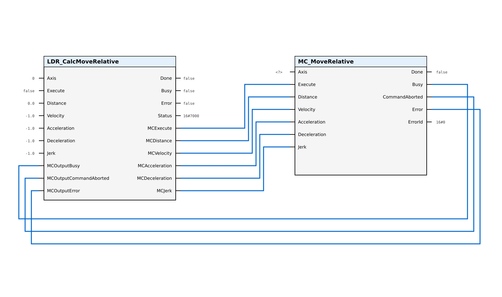
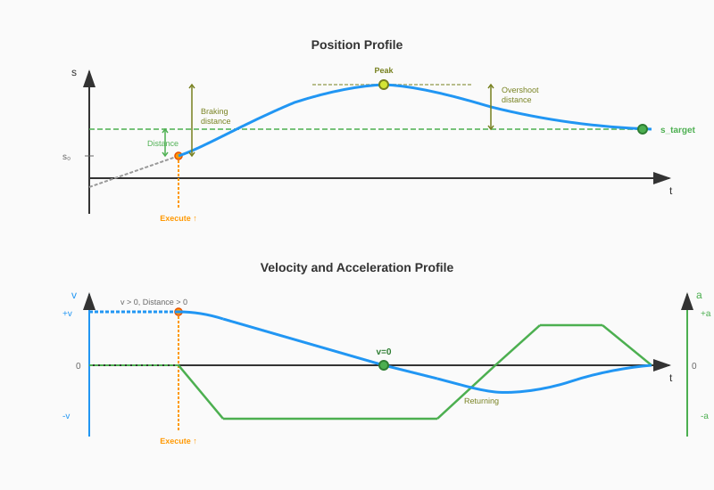

# CalcMoveRelative

The `CalcMoveRelative` function block enables dynamic velocity reversal for relative positioning based on the `MC_MoveRelative` instruction. It calculates the parameters for `MC_MoveRelative` to achieve smooth direction changes without reaching a complete standstill.

## Applicable Technology Objects

| Technology Object | Supported |
| ----------------- | --------- |
| TO_SpeedAxis | No |
| TO_PositioningAxis | Yes |
| TO_SynchronousAxis | Yes |

## Call Diagram

The function block must be called **before** `MC_MoveRelative` in each program cycle.

## Interface

### VAR_INPUT

| Name | Type | Default | Description |
| ---- | ---- | ------- | ----------- |
| `axis` | DB_ANY | — | Technology Object axis reference |
| `execute` | BOOL | — | Rising edge starts the dynamic reversal calculation |
| `distance` | LREAL | — | Relative distance [Unit of TO]. Sign determines direction. |
| `velocity` | LREAL | -1.0 | Velocity magnitude [Unit of TO]. < 0.0: use TO default. 0.0: not permitted. |
| `acceleration` | LREAL | -1.0 | Acceleration [Unit of TO]. < 0.0: use TO default. 0.0: not permitted. |
| `deceleration` | LREAL | -1.0 | Deceleration [Unit of TO]. < 0.0: use TO default. 0.0: not permitted. |
| `jerk` | LREAL | -1.0 | Jerk [Unit of TO]. < 0.0: use TO default. 0.0: disables jerk limitation. |
| `mcOutputBusy` | BOOL | — | Connect to MC_MoveRelative.Busy |
| `mcOutputCommandAborted` | BOOL | — | Connect to MC_MoveRelative.CommandAborted |
| `mcOutputError` | BOOL | — | Connect to MC_MoveRelative.Error |

### VAR_OUTPUT

| Name | Type | Default | Description |
| ---- | ---- | ------- | ----------- |
| `done` | BOOL | FALSE | TRUE: Reversal calculation completed, final MC command issued |
| `busy` | BOOL | FALSE | TRUE: Function block is actively processing |
| `error` | BOOL | FALSE | TRUE: An error occurred during execution |
| `status` | WORD | Status#NO_CALL | Status/warning/error code (see [Status Codes](07_Status_Codes.md)) |
| `mcExecute` | BOOL | FALSE | Connect to MC_MoveRelative.Execute |
| `mcDistance` | LREAL | 0.0 | Connect to MC_MoveRelative.Distance |
| `mcVelocity` | LREAL | -1.0 | Connect to MC_MoveRelative.Velocity |
| `mcAcceleration` | LREAL | -1.0 | Connect to MC_MoveRelative.Acceleration |
| `mcDeceleration` | LREAL | -1.0 | Connect to MC_MoveRelative.Deceleration |
| `mcJerk` | LREAL | -1.0 | Connect to MC_MoveRelative.Jerk |

## Distance Handling

The `distance` input specifies the relative distance to travel. The sign determines the direction:

| Distance | Direction |
| -------- | --------- |
| > 0.0 | Positive direction |
| < 0.0 | Negative direction |
| = 0.0 | No movement |

> **Note:** There is no separate `direction` parameter. The direction is derived entirely from the sign of `distance`.

## Velocity Handling

The `velocity` input is interpreted as a magnitude only. The direction of travel is determined by the sign of the `distance` parameter.

> **Note:**
> A velocity of `0.0` is **not** permitted.
> A value `< 0.0` selects the Technology Object's default velocity.

## Modulo Axis Support

`CalcMoveRelative` supports modulo axes, including moves that span multiple rotations (where |distance| > modulo length). The block uses cumulative distance tracking to correctly handle wrap-around scenarios and ensure the axis reaches the intended final position.

## Dynamic Reversal Feasibility

Dynamic reversal requires that both the deceleration phase (current velocity to zero) and the acceleration phase (zero to target velocity) result in trapezoidal profiles. This means the maximum acceleration and deceleration values must be reached during the motion.

If either phase would be triangular (maximum not reached), dynamic reversal is not possible. The block issues warning `Warnings#NO_DYNAMIC_REVERSAL_POSSIBLE` and executes a standard motion profile.

For details on the three-phase reversal mechanism, see [Velocity Reversal Information](02_Basic_Information.md).

## Behavior Notes

### done vs MC_MoveRelative.Done

The `done` output indicates that the LDR block has finished its calculation and issued the final MC command. This does **not** mean the axis has reached the target position. To detect when the target position is reached, monitor `MC_MoveRelative.Done`.

### Retriggering Behavior

A new rising edge on `execute` while `status <> Status#NO_CALL` is ignored. To command a new relative move, wait for `done` or `error`, then issue a new `execute` rising edge.

> **Note:** Unlike retriggering `MC_MoveRelative` directly (which starts a new move from the current position each time), `CalcMoveRelative` calculates the remaining distance to the original target during its processing phases. This ensures accurate final positioning even when multiple MC commands are issued internally.

### Abort Handling

If `MC_MoveRelative.CommandAborted` becomes TRUE during processing (e.g., due to `MC_Halt`), the block transitions to error state with `status = Errors#MC_COMMAND_ABORTED`. No further MC commands are issued until the next `execute` rising edge.

### Overshoot Detection

When the axis is moving in the same direction as the target distance but the braking distance exceeds the target distance, the block detects that the axis will overshoot and need to reverse back. This scenario is handled as a dynamic reversal.

