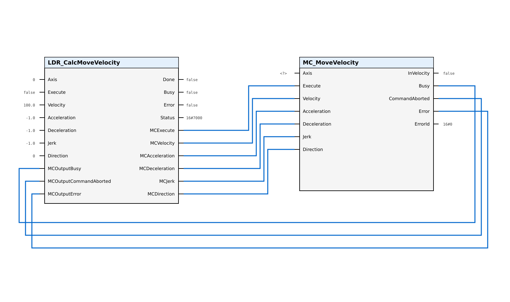

# CalcMoveVelocity

The `CalcMoveVelocity` function block enables dynamic velocity reversal for velocity-controlled motion based on the `MC_MoveVelocity` instruction. It calculates the parameters for `MC_MoveVelocity` to achieve smooth direction changes without reaching a complete standstill.

## Applicable Technology Objects

| Technology Object | Supported |
| ----------------- | --------- |
| TO_SpeedAxis | Yes |
| TO_PositioningAxis | Yes |
| TO_SynchronousAxis | Yes |

## Call Diagram

The function block must be called **before** `MC_MoveVelocity` in each program cycle.

## Interface

### VAR_INPUT

| Name | Type | Default | Description |
| ---- | ---- | ------- | ----------- |
| `axis` | DB_ANY | — | Technology Object axis reference |
| `execute` | BOOL | — | Rising edge starts the dynamic reversal calculation |
| `velocity` | LREAL | 100.0 | Target velocity [Unit of TO]. Sign determines direction. 0.0 is permitted. |
| `acceleration` | LREAL | -1.0 | Acceleration [Unit of TO]. < 0.0: use TO default. 0.0: not permitted. |
| `deceleration` | LREAL | -1.0 | Deceleration [Unit of TO]. < 0.0: use TO default. 0.0: not permitted. |
| `jerk` | LREAL | -1.0 | Jerk [Unit of TO]. < 0.0: use TO default. 0.0: disables jerk limitation. |
| `direction` | INT | 0 | 0: use sign of velocity, 1: positive, 2: negative |
| `mcOutputBusy` | BOOL | — | Connect to MC_MoveVelocity.Busy |
| `mcOutputCommandAborted` | BOOL | — | Connect to MC_MoveVelocity.CommandAborted |
| `mcOutputError` | BOOL | — | Connect to MC_MoveVelocity.Error |

### VAR_OUTPUT

| Name | Type | Default | Description |
| ---- | ---- | ------- | ----------- |
| `done` | BOOL | FALSE | TRUE: Reversal calculation completed, final MC command issued |
| `busy` | BOOL | FALSE | TRUE: Function block is actively processing |
| `error` | BOOL | FALSE | TRUE: An error occurred during execution |
| `status` | WORD | Status#NO_CALL | Status/warning/error code (see [Status Codes](07_Status_Codes.md)) |
| `mcExecute` | BOOL | FALSE | Connect to MC_MoveVelocity.Execute |
| `mcVelocity` | LREAL | -1.0 | Connect to MC_MoveVelocity.Velocity |
| `mcAcceleration` | LREAL | -1.0 | Connect to MC_MoveVelocity.Acceleration |
| `mcDeceleration` | LREAL | -1.0 | Connect to MC_MoveVelocity.Deceleration |
| `mcJerk` | LREAL | -1.0 | Connect to MC_MoveVelocity.Jerk |
| `mcDirection` | INT | 0 | Connect to MC_MoveVelocity.Direction |

## Velocity and Direction Handling

The velocity parameter for `CalcMoveVelocity` is interpreted in the same manner as for `MC_MoveVelocity`.

> **Note:**
> A velocity of `0.0` is permitted and brings the axis to standstill.
> The value `-1.0` does **not** select the default velocity. It means 1 unit/s in negative direction.

The `direction` input follows the `MC_MoveVelocity` definition:

| Value | Behavior |
| ----- | -------- |
| 0 | Use sign of `velocity` parameter |
| 1 | Positive direction (use absolute value of velocity) |
| 2 | Negative direction (use negated absolute value of velocity) |

## Dynamic Reversal Feasibility

`CalcMoveVelocity` and the related `MC_MoveVelocity` have no distance constraint. The feasibility check is based solely on the motion profile:

Dynamic reversal requires trapezoidal profiles for both the deceleration phase (current velocity to zero) and the acceleration phase (zero to target velocity).

If either phase results in a triangular profile (maximum acceleration/deceleration is never reached), dynamic reversal is not possible. The block issues warning `Warnings#NO_DYNAMIC_REVERSAL_POSSIBLE` and executes a standard velocity change.

A triangular profile occurs when:

- Jerk is low relative to the velocity change and acceleration/deceleration values
- The axis would need to start reducing acceleration before it reaches maximum

For details on the three-phase reversal mechanism, see [Velocity Reversal Information](02_Basic_Information.md).

## Behavior Notes

### done vs InVelocity

The `done` output indicates that the LDR block has finished its calculation and issued the final MC command. This does **not** mean the axis has reached the target velocity. To detect when the target velocity is reached, monitor `MC_MoveVelocity.InVelocity`.

### Retriggering

A new rising edge on `execute` while `status <> Status#NO_CALL` is ignored. To command a new velocity, wait for `done` or `error`, then issue a new `execute` rising edge.

### Abort Handling

If `MC_MoveVelocity.CommandAborted` becomes TRUE during processing (e.g., due to `MC_Halt`), the block transitions to error state with `status = Errors#MC_COMMAND_ABORTED`. No further MC commands are issued until the next `execute` rising edge.
